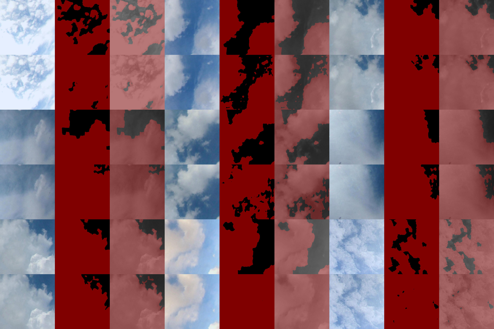

### Let's start training a semantic segmentation deep learning model
  
1) Preparing Docker

Go to the website and install the Docker on your device with regard to your OS.
```
https://docs.docker.com/get-docker/
```

If users already have or installed Docker, then you can download our Docker image:
```
docker pull classicblue/plugin-pytorch-fcn:0.2.0
```

2) Preparing Dataset

Waggle team provides an example dataset for cloud segmentation for users of this plugin. Users can download the images through below:

```
from torchvision.datasets.utils import download_and_extract_archive
url = 'https://web.lcrc.anl.gov/public/waggle/datasets/WaggleClouds.tar.gz'
download_and_extract_archive(url, 'download', 'data')
```

Below is the example image from the cloud dataset that Waggle team is providing.

<p align="center">
<kbd></kbd> <kbd></kbd>
</p>


3) Preparing Class List

With the images,`class_names.list` is required. The list need to be stored in the same folder where the `images` and `labels` exist. The `class_names.list` is the name of classes that the users target to train for. For example, to train a model for cloud segmentation, the `class_names.list` contiains:
```
sky
cloud
```

4) Preparing Model Configuration

The `config.list` is the configuration of the training such as maximum iteration (`max_iteration`), learning rate (`lr`),  directory name for saving logs and models (`output_dir`), and so on. An example of a configuration for training Resnet based fcn101 network is provided below: 
```
{
    "max_iteration": 100000, 
    "lr": 1e-10, 
    "momentum": 0.99, 
    "weight_decay": 0.0005, 
    "interval_validate": 4000,
    "backbone": "resnet",
    "fcn": "101",
    "output_dir": "resnet101",
    "pretrained_net": ""
}
```

The Docker image provides Resnet as backbone network, and fcn101 and fcn50 as fcn network. So user can choose either resnet-fcn101 or resent-fcn50.


5) Pre-trained models

The plugin requires a pretrained fcn model with regard to what the user is tyring to train. If the host machine is connected to the internet, it will automatically download the pretrained model from the PyTorch server. If users want to provide a pretrained model, the path of the pretrained model can be listed in the configuration `"pretrained_net": ""`.


6) Check the folder to mount it to Docker container

All of the files and folders must be in one folder. For example:
```
foler
 ├─ images
 │     ├─ image1
 │     ├─ image2
 │     └─ ...      
 ├─ labels
 │     ├─ image1
 │     ├─ image2
 │     └─ ...
 ├─ class_names.list
 ├─ class_colors.list (not supported yet)
 └─ config.list
```


7) Training

To train, simply run the command below on the host machine. Please make sure to set all the path correct. The folder that contains training data needs to be mounted to `/storage`.

For example to use waggle cloud images with 16GB shared memory to train resnet-fcn101 network:
```
# skip --runtime nvidia if the host is not CUDA accelerated
docker run -d --rm --name plugin-training-fcn --runtime nvidia --shm-size 16G -v ${PATH_FOR_INPUT_IMAGES_FOLDER}:/storage classicblue/plugin-training-fcn:0.2.0 --config config.list --image_type waggle_cloud
```

_Note: if host machine does not support 16GB shared memory, users can reduce the shared memory._

8) Check Progress

The log of the training can be shown by,

```
docker logs -f plugin-training-fcn
```

9) Check Training Logs

After the training is completed checkpoint models and logs can be found in `${PATH_FOR_INPUT_IMAGES_FOLDER}/MODEL-${output_dir}` on the host machine. The logs are stored in a csv file as shown below, and users can handle the data as they familiar with.

```
epoch,iteration,train/loss,train/acc,train/acc_cls,train/mean_iu,train/fwavacc,valid/loss,valid/acc,valid/acc_cls,valid/mean_iu,valid/fwavacc,elapsed_time
0,0,,,,,,249565.46875,0.2775708506944444,0.5,0.1387854253472222,0.07704557715523756,19.109297
0,0,249565.46875,0.0,0.0,0.0,0.0,,,,,,19.882988
0,1,249565.46875,0.6447888888888889,0.5,0.32239444444444443,0.41575271123456786,,,,,,20.023459
0,2,249482.25,1.0,1.0,1.0,1.0,,,,,,20.166056
0,3,249534.78125,0.30164722222222223,0.5,0.15082361111111112,0.09099104667438272,,,,,,20.306398
0,4,249511.15625,0.72165,0.5,0.360825,0.5207787225,,,,,,20.449825
0,5,249447.375,1.0,1.0,1.0,1.0,,,,,,20.589101
0,6,249528.6875,0.5119666666666667,0.5,0.25598333333333334,0.2621098677777778,,,,,,20.73057
0,7,249434.390625,1.0,1.0,1.0,1.0,,,,,,20.870793
```

In addition to the logs, validation results are stored in `${PATH_FOR_INPUT_IMAGES_FOLDER}/MODEL-${output_dir}/visualization_viz`. 

The results showed in order as listed below:
```
+-----------------------+-----------------------+---------------------------+
|  original image       | ground truth image    | overlap of the two images |
+-----------------------+-----------------------+---------------------------+
|  original image       | estimation result     | overlap of the two images |
+-----------------------+-----------------------+---------------------------+
```

Below is sample validation results:

<p align="center">

</p>
